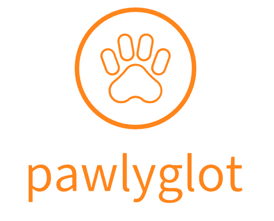

    

---

**pawlyglot** is a project that aims to develop an end-to-end multilingual TTS, voice-cloning and lip-syncing pipeline, by combining several open-source projects.

Currently, the plan is to use the following projects:

1. Voice Activity Detection - SpeechBrain CRDNN
1. Speech Recognition - NVIDIA NeMo Parakeet-CTC (600M)
2. Machine Translation - Meta NLLB-200-Distilled (600M)
3. Voice Cloning and TTS - Coqui XTTS-V2
4. Lip Sync - Wav2Lip-GFPGAN

---
